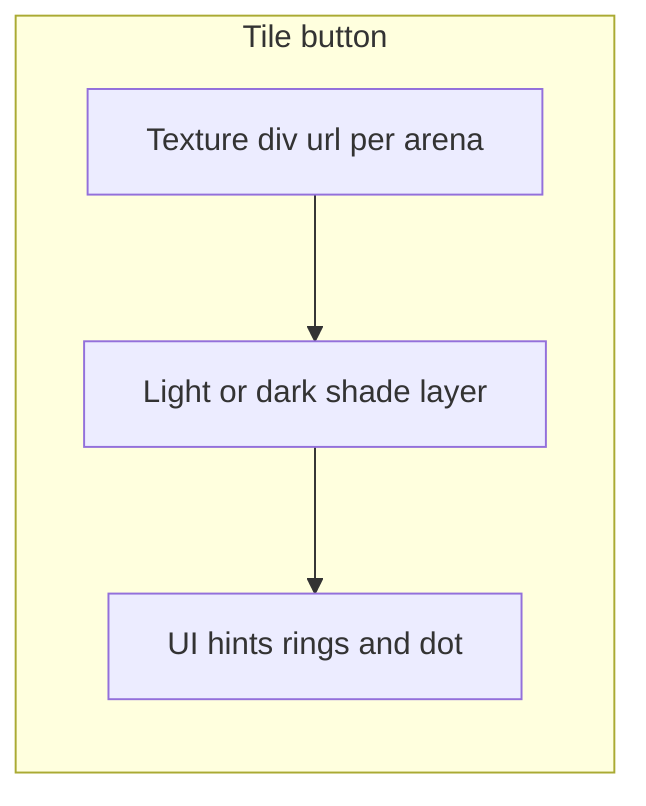

# Themed textured board tiles

## Current behavior

- [`Tile.tsx`](pokepath/src/components/board/Tile.tsx) calls `getArenaTileClasses(arena, isLight)` for a flat `bg-*` checkerboard.
- [`GameBoard.tsx`](pokepath/src/components/board/GameBoard.tsx) already sets `isLight={(x + y) % 2 === 0}` (no change needed).
- [`arenaTheme.ts`](pokepath/src/lib/board/arenaTheme.ts) holds the `TILES` record keyed by [`BoardArenaId`](pokepath/src/types/game.ts): `water`, `grass`, `fire`, `air`, `electric`, `ground`.

**Naming note:** The codebase uses **`ground`**, not `rock`. Your flagstone reference maps to **`ground`** for both texture file and `BoardArenaId` (no type/DB migration unless you explicitly want a rename later).

## Asset strategy

1. Add a folder under the Next app static tree, e.g. [`pokepath/public/board-tiles/`](pokepath/public/board-tiles/), with one PNG per arena: `fire.png`, `water.png`, `ground.png`, `grass.png`, `air.png`, `electric.png`.
2. **Source files:** Copy from the six files already in the Cursor assets path (listed in your message under `image_files`). During implementation, **match each screenshot to the correct theme by quick visual check** (timestamps alone are not reliable). Expected mapping from the attached descriptions: lava/fire, tan flagstone/rock→`ground`, cyan crystalline/water, lavender wispy/air, circuit/electric, grass photo/grass.

## Rendering approach

**Goal:** Same thematic texture on every tile of that arena, with **light vs dark** squares still readable.

- **Texture layer:** Absolutely positioned inner element on each tile with `backgroundImage: url(/board-tiles/<arena>.png)`, `backgroundSize: 'cover'`, `backgroundPosition: 'center'`, parent `overflow-hidden` (tile is already square in the 9×9 grid).
- **Checkerboard:** Keep one base image per arena; differentiate with a second layer:
  - **Light:** no overlay, optional slight `brightness-105` if needed.
  - **Dark:** semi-opaque overlay (e.g. `bg-black/30` or `bg-black/25`) **or** `brightness-75` on the texture layer — pick one approach and tune so move hints (ring + dot from [`arenaTheme.ts`](pokepath/src/lib/board/arenaTheme.ts)) stay visible.
- **Dark mode:** Add a modest extra dimming on the whole board or on dark cells only (e.g. `dark:` variants on the overlay) so UI does not blow out on light textures.
- **Remove conflicting flat tile colors** from `TILES` in `getArenaTileClasses` (or stop using them for fill) so textures show through; keep **fence chrome, valid dot, rings, pending ring** as today (they already sit on top in `Tile`).

## Code changes

| Area | Change |
|------|--------|
| [`arenaTheme.ts`](pokepath/src/lib/board/arenaTheme.ts) | Export a small API: e.g. `getArenaTileTextureUrl(arena)` → `'/board-tiles/fire.png'` etc., and `getArenaTileShadeClasses(isLight)` (or combined helper) for light/dark overlay classes. Optionally keep a very subtle neutral `ring-offset` class if rings need a cleaner edge. |
| [`Tile.tsx`](pokepath/src/components/board/Tile.tsx) | Structure: `button` → background stack (texture + shade) → existing hint/dot content at `z-10` with `pointer-events-none` where needed. Preserve `hover:brightness-95` on interactive move tiles in a way that does not break the stack (often apply hover on the button, not only the image). |

## Tests (repo convention)

Add [`pokepath/src/lib/board/arenaTheme.tileTexture.test.ts`](pokepath/src/lib/board/arenaTheme.tileTexture.test.ts) (or extend a new test file) asserting:

- Every `BOARD_ARENA_IDS` entry resolves to a **distinct** `/board-tiles/*.png` path.
- `getArenaTileShadeClasses` (or equivalent) returns different class strings for `isLight` true vs false.

No need to snapshot-test pixels.

## Verification

- Run `pnpm test` and `pnpm lint` from `pokepath`.
- Manually cycle arenas (local play / match) and confirm textures, checkerboard contrast, and move/fence affordances.

