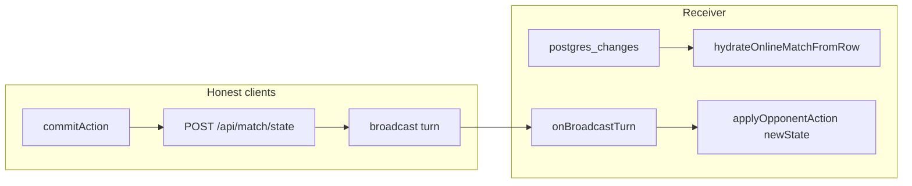

# Bug audit: PokéPath / pokemon-battle

## Summary

The authoritative game rules live in [`pokepath/src/lib/engine/`](pokepath/src/lib/engine/) (`validateMove`, `validateFencePlacement`, `applyCommittedTurn`) and are enforced on the server in [`pokepath/src/app/api/match/state/route.ts`](pokepath/src/app/api/match/state/route.ts). Multiplayer UX also depends on Supabase broadcast + postgres in [`pokepath/src/app/match/[matchId]/page.tsx`](pokepath/src/app/match/[matchId]/page.tsx) and commit UX in [`pokepath/src/components/ui/MobileActionTray.tsx`](pokepath/src/components/ui/MobileActionTray.tsx).

---

## 1. Trap fence treated as successful commit (definite bug)

**Where:** [`MobileActionTray.tsx`](pokepath/src/components/ui/MobileActionTray.tsx) `commitAction` callback (~53–94).

**What:** On `TRAP_OPPONENT`, [`gameStore.commitAction`](pokepath/src/lib/store/gameStore.ts) sets `errorCode: 'TRAP_OPPONENT'` and `error: null`, then returns **without** mutating the board or clearing `pendingAction` (lines 182–190).

The tray shows the trap toast and clears the code, then checks `err` — which is still **null** — so execution enters the `else` branch and runs `afterSuccessfulCommit` as if the move succeeded.

**Impact:**

- Unnecessary `POST /api/match/state` (server rejects; wasted latency).
- Catch path shows **“Move not saved — try again.”** in addition to the trap toast — confusing UX ([`page.tsx` `afterSuccessfulCommit`](pokepath/src/app/match/[matchId]/page.tsx) throws on non-OK responses; tray catch at lines 88–90).

**Fix direction:** After handling `TRAP_OPPONENT`, **return early** and do not call `afterSuccessfulCommit` (same as any failed commit: no persistence path).

---

## 2. `stateVersionRef` / `plyCount` can drift +1 vs DB (race)

**Where:** [`match/[matchId]/page.tsx`](pokepath/src/app/match/[matchId]/page.tsx) — `postgres_changes` (~342–355) vs `onBroadcastTurn` (~326–327).

**What:**

- Postgres handler: only updates when `v > stateVersionRef.current`, then sets `stateVersionRef.current = v`.
- Broadcast handler: always does `stateVersionRef.current += 1` after validation.

If the **postgres** update for version `N` arrives **first** (ref becomes `N`), then the **broadcast** for that same ply still runs `+= 1` (ref becomes `N+1` while the DB stays at `N`).

**Impact:**

- Wrong `totalTurns` sent to [`/api/match/end`](pokepath/src/app/api/match/end/route.ts) (`plyCount.current`).
- Next `POST /api/match/state` sends `baseVersion` one higher than `matches.state_version` → recurring **409 conflict** until something resyncs the ref (e.g. conflict handler).

**Fix direction:** Prefer a **single source of truth** for ply/version on receive, for example:

- Include `stateVersion` from the server JSON in the broadcast payload (sender already has it after commit), and set `stateVersionRef.current = payload.stateVersion` (or `Math.max(ref, payload.stateVersion)`), **or**
- On broadcast, do not increment; only apply board + rely on postgres for ref (with tradeoff if realtime is slow), **or**
- Increment only when `stateVersionRef.current < expectedNext` using monotonic rules.

---

## 3. Opponent broadcast trusts `newState` (integrity / cheat)

**Where:** [`onBroadcastTurn`](pokepath/src/app/match/[matchId]/page.tsx) (~315–337).

**What:** [`validateIncomingTurn`](pokepath/src/lib/match/validateIncomingTurn.ts) checks that `p.action` is legal on the **current** store state. It does **not** prove that `p.newState` is the result of applying that action.

The client then applies `p.newState` via `applyOpponentAction`.

**Impact:** A modified client could send a legal `action` but an arbitrary `newState` (teleport, extra fences, etc.). Honest peers would show a wrong board until a full hydrate from DB (if/when postgres catches up). Server truth remains protected for persistence, but **local PvP experience and any logic that trusts local store** are wrong.

**Fix direction:** After `validateIncomingTurn`, derive the next snapshot with [`applyCommittedTurn`](pokepath/src/lib/engine/applyCommittedTurn.ts) (plus the same board Pokémon merge as the server: [`mergeBoardPokemonAfterCommit`](pokepath/src/lib/match/mergeBoardPokemonAfterCommit.ts) using `p.newState` only for validated actor board Pokémon species id), then apply **that** snapshot (or reject if `normalizedTurnSnapshotJson` does not match opponent payload).

---

## 4. Weaker / hygiene issues (lower severity)

| Item | Location | Note |
|------|----------|------|
| **Loose `pendingAction` parse** | [`parsePersistedMatchState.ts`](pokepath/src/lib/match/parsePersistedMatchState.ts) ~46–52 | Casts unknown `pa` to `PendingAction` without validating `targetPos` / `targetFence`. Bad DB JSON could yield odd client state until next write. |
| **`totalTurns` unvalidated** | [`match/end/route.ts`](pokepath/src/app/api/match/end/route.ts) | Body `totalTurns` is stored from client; could be inflated vs `state_version`. Cosmetic/stats integrity only. |
| **`fencesLeft` NaN** | [`parsePersistedMatchState.ts`](pokepath/src/lib/match/parsePersistedMatchState.ts) | `Number(p1.fencesLeft)` without `Number.isFinite` check could propagate NaN. |

---

## 5. Not bugs (clarifications)

- **[`moveValidator.ts`](pokepath/src/lib/engine/moveValidator.ts) orthogonal step onto opponent:** The `if (samePos(targetPos, opponentPos))` branch intentionally falls through; execution eventually hits the final `Invalid move distance`. Confusing structure but logically rejects the move.
- **`pickTurnSnapshot` truthiness** ([`snapshotUtils.ts`](pokepath/src/lib/match/snapshotUtils.ts) line 14): `targetPos ?` is safe for normal `{x,y}` objects on this board (including `0` coordinates); only exotic falsy primitives would drop the clone.

---

## Suggested verification (after implementation)

- Unit test: `MobileActionTray` / store integration — trap fence must **not** invoke persistence callback (mock `afterSuccessfulCommit`).
- Unit or integration test: simulate postgres handler setting ref to `N`, then broadcast for same ply — ref must stay `N` (or match server version), not `N+1`.
- Test: `onBroadcastTurn` with mismatched `newState` vs `applyCommittedTurn` — receiver should reject or overwrite with derived state.
